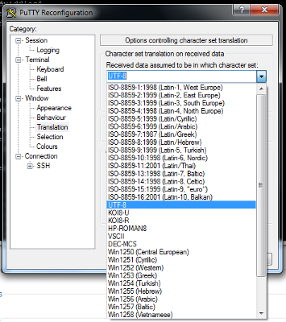

#Accéder à nos machines
##Connexion distante via SSH
###Linux / Mac OS

Rien de plus simple vous ouvrez un terminal et vous y tapez :

	ssh login@ares-ensiie.eu

En remplaçant bien évidemment login, par votre identifiant ARES.

###Windows

Vous devez télécharger PuTTY

Puis, c'est exactement comme sous les autres systèmes d'exploitation. Connectez-vous à `login@ares-ensiie.eu`.

##Problèmes courants

PuTTy : Mon terminal des choses bizarre avec EncodagePutty

###Encodage des caractères avec PuTTy

Nos serveurs sont configurés pour fonctionner en UTF-8. PuTTY par défaut n'utilise pas d'UTF-8, il faut le configurer, pour cela rien de plus simple.

→ Lorsque vous lancez PuTTy rendez vous dans la partie `translation`, puis modifiez la valeur pour utiliser l'UTF-8 comme ci-dessous:

	

