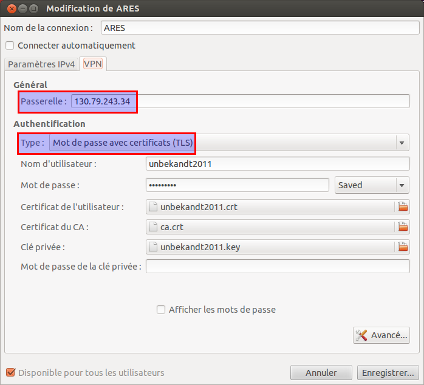
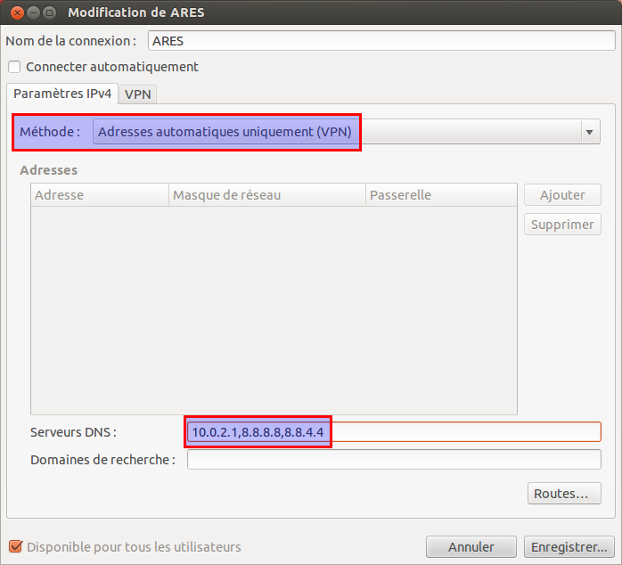

#Connexion au VPN

Vous en avez marre du firewall de l'ISU et de son proxy infernal ! Oui à ARES aussi on en a GROS ! C'est pour ça que nous vous proposons de passer par nos machines pour sortir sur le vaste Internet.
Qu'est-ce qu'un VPN (Virtual Private Network)

En deux mots quand vous êtes à l'ISU et que vous vous connectez au wifi ENSIIE:
##Sans VPN

  Votre requête sur `http://google.com` passe doit passer par le proxy de l'ISU (où elle est analysée btw) avant de sortir dans le vaste espace.
    Lorsque vous essayez de vous connecter à notre serveur Minecraft, la connexion échoue lamentablement car l'ISU a eu la bonne idée de bloquer l'intégralité des ports sauf quelques uns.

##Avec VPN

Un lien chiffré illisible par l'ISU relie votre ordinateur à nos serveurs, vous êtes virtuellement branchés sur le même switch que notre infrastructure.
    La conséquence direct c'est que nous ne filtrons rien, donc il n'y a plus de proxy et tous les ports sont accessibles.

→ Plus de proxy, et tous les protocoles accessibles.

##Responsabilité

Vous ne passez plus par l'infrastructure de l'ISU, mais vous passez par les machines de l'association. Nous vous identifions et nous avons l'obligation légal d'enregistrer vos connexion pendant la durée d'un an. Donc notre VPN est loin d'être anonyme. Si vous cherchez quelque chose comme ça, 5€/mois c'est pas de trop ;-) Nous nous basons sur un principe de fair use, comprendre que si une personne mange en permanence notre bande passante nous prendrons les mesures nécessaires. De la même manière nous sanctionnerons dans le cas d'un usage illégal de notre connexion.
##Comment se connecter ?

Pour ajouter l'intégration de network manager à Network Manager, votre gestionnaire de connexions : 

	sudo apt-get install network-manager-openvpn

Tout d'abord, quelque soit la technique, il est nécessaire de récupérer quelques fichiers.

`https://vpn.ares-ensiie.eu` :

	

###Sous Linux
####Graphiquement (GNOME/Unity)

#####Ajout d'un VPN : 

	
	

#####Type de VPN : 

	

#####Configuration :

	
	
	

#####Connexion : 

	
	

####En ligne de commande (Universel)

Télécharger le fichier ce configuration suivant : `conf.zip` et décompressez le. Changer ensuite l'emplacement ca, cert et key puis faites :

	openvpn –config /chemin/vers/client.conf

Remplacez le contenu de `/etc/resolv.conf` par

    domain ares
    nameserver 10.0.2.1
    nameserver 8.8.8.8

Il se peut qu'en vous connectant en ligne de commande vous ayez des problèmes de routage, il faut préciser la règle suivant

	route add 130.79.243.34/32 [VotrePasserelleParDéfaut]
	
###Sous Windows

Tout d'abord il vous faut installer OpenVPN pour Windows

Récupérez ensuite le fichier de configuration d'OpenVPN : `conf.zip`

Décompressez puis placez le ainsi que les certificats et la clef dans le dossier suivant :

    C:\Program Files (x86)\OpenVPN\config (Pour Windows 64bits)
    C:\Program Files\OpenVPN\config (Pour Windows 32bits)

Editez le fichier de configuration et modifiez les champs ca, cert et key.

`client.conf`:

    ca ca.crt
    cert $USER$.crt
    key $USER$.key

Renommez le en `client.ovpn`.

Lancez l'application OpenVPN GUI qui va automatiquement détecter le fichier de configuration et vous demander vos identifiants.

Cependant ce n'est pas forcément suffisant, car Windows c'est tout pourri =D

Lancez un terminal en tant qu'administrateur:

	

Lancez la commande:
 
	route print 
vous pourrez observer ça :

	

Repérez l'identifiant de votre interface, pour ma part:

	 Dell Wireless → 12

Et lancez la commande:

	route add 130.79.243.34 $IPGATEWAY if $IFID

A l'ISU réseau “ENSIIE”:

	IPGATEWAY : 172.16.41.254

route

    route add 130.79.243.34 172.16.41.254 if 12

###Sous Mac OS X

Après avoir installé `openvpn`, utiliser la technique en ligne de commande Linux.